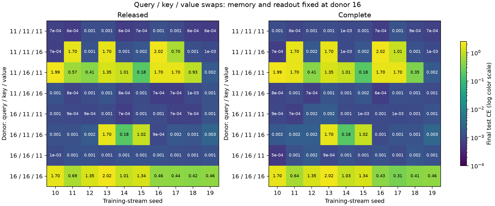

# Query and value swaps rescue separately but can interfere when combined

13 September 2026. **Completed query/key/value factorial: 120 new models and 40 reused endpoint outcomes.** [Protocol](EMBEDDING_SWAP_PROTOCOL.md), [manifest](../analysis/embedding_swap/manifest.json), [full results](../analysis/embedding_swap/summary.json), [verification](../analysis/embedding_swap/verification.json).

In the fixed donor-16 memory/readout background, replacing **only query embeddings** or **only value embeddings** with donor-11 values changes low-loss success from 0/10 streams to 10/10 under both derivative rules. However, combining those two replacements while retaining donor-16 keys gives only 1/10 success. Replacing all three embeddings gives 10/10.

This rules out a one-tensor ranking in which a donor's query or value embeddings are uniformly better. The effective initial condition depends strongly on the compatibility of the embedding groups. The conclusion concerns selected donors under the fixed task and 600-update budget; it is not a general initialization rule.

## Full configuration outcomes

Memory, readout, rate/decay predictors and LayerNorm are held at their original untrained donor-16 values. Each column denotes the donor of a separate learned embedding matrix. Low loss is final validation CE < 0.1; mean test CE is in nats per query across ten matched streams.

| Query | Key | Value | Released CE | Complete CE | Released low loss | Complete low loss |
| ---: | ---: | ---: | ---: | ---: | ---: | ---: |
| 11 | 11 | 11 | 0.000844 | 0.000985 | 10/10 | 10/10 |
| 11 | 11 | 16 | 0.613057 | 0.643914 | 6/10 | 6/10 |
| 11 | 16 | 11 | 0.984114 | 1.039997 | 1/10 | 1/10 |
| 11 | 16 | 16 | 0.001008 | 0.001049 | 10/10 | 10/10 |
| 16 | 11 | 11 | 0.000948 | 0.001158 | 10/10 | 10/10 |
| 16 | 11 | 16 | 0.291014 | 0.291393 | 7/10 | 7/10 |
| 16 | 16 | 11 | 0.001215 | 0.001210 | 10/10 | 10/10 |
| 16 | 16 | 16 | 0.989160 | 0.970737 | 0/10 | 0/10 |

A query-only replacement reduces mean CE by 0.988152 released and 0.969687 complete. A value-only replacement reduces it by 0.987945 and 0.969526. A key-only replacement gives 7/10 success under both rules, with mean CE reductions of 0.698146 and 0.679344.

The combined query+value replacement has mean CE 0.984114 released and 1.039997 complete, compared with 0.989160 and 0.970737 for the all-16 baseline. Thus two individually effective interventions do not add: their combination largely loses the benefit unless keys are also changed. Conversely, changing key+value while retaining donor-16 queries reaches low loss on all ten streams. The same qualitative success pattern holds under both derivatives.

## Marginal contrasts and why they are insufficient alone

Marginal contrasts average donor-11-minus-donor-16 test CE over all four backgrounds of the other two embeddings, paired within stream. Negative favors donor 11.

| Embedding | Released marginal contrast | Complete marginal contrast |
| --- | ---: | ---: |
| Query | +0.079172 | +0.105362 |
| Key | -0.267408 | -0.268886 |
| Value | -0.226780 | -0.215936 |

The donor-11 query marginal is positive despite its decisive benefit in the all-16 background. This is precisely why the protocol retained all reciprocal/background contrasts: an average treatment effect can hide a useful intervention in one background and a harmful interaction in another. All per-stream differences, ranges, accuracies, validation areas and no-adaptation metrics remain available in the summary JSON.

## Initialization geometry and interpretation

An [initialization-only geometry inspection](../analysis/initial_geometry.json), using [this script](../scripts/inspect_initial_geometry.py), found modest singular-value condition numbers for both donors' query/key/value matrices: approximately 2.67–4.12. The difficult donor is not explained by a nearly singular raw embedding matrix in this comparison. This is a descriptive observation, not a proof that all relevant dynamic conditioning is benign.

Query–key matching cosine means range from −0.0403 to +0.1340 across the four query/key donor pairings. A successful query-only rescue uses the pairing with the lowest mean, while changing value embeddings can reverse its success without changing query–key cosines at all. Initial query–key cosine alignment alone is therefore insufficient to explain this factorial. No geometry threshold was used to select training runs.

The evidence so far supports **initial representation compatibility and optimization trajectories**, rather than a universal good/bad embedding tensor or a fast-matrix-only explanation. It does not identify the precise dynamical mechanism. A post-hoc inspection of class-conditional predictions and memory representations is the next read-only diagnostic, motivated by the repeated discrete-looking loss plateaus. That diagnostic is separate from the prespecified swap outcomes.

## Methods and verification

The full 2×2×2 factorial uses original untrained query/key/value tensors from the same selected donors 11 and 16, with all non-embedding state fixed at donor 16. The architecture has 1,196 parameters, depth 2, chunk 4 and width 16. Training uses the same ten streams, data split, 600 updates, optimizer and evaluation seeds as prior comparisons. This is an adaptive study on a reused synthetic task, not a new untouched test set or independent donor replication.

Before new training, the preflight checked every tensor's origin and exact ten-step training parity with the previous all-11/all-16 embedding baselines on excluded stream 99. Frozen hashes cover the protocol, runner, helpers, preflight, donor results and prior provenance. All 160 checkpoints reproduce final test, final validation and no-adaptation metrics exactly. Verification also reconstructs hybrid initial hashes, regenerates the training streams, preserves reused records and checks target isolation and no-adaptation value invariance.

New training processed 36,864,000 events and took 359.72 measured CPU training-loop seconds, excluding evaluation and batch construction. Reused endpoints add no new training cost. Runtime is deterministic CPU float32, one thread, torch 2.14.0/einops 0.8.1 with uv locks and pinned upstream `33afe26100f8590272940e55dbee5067a8040da6`, using explicit CPU kernel substitutions. No natural-language training or remote model was used.

[Runner](../scripts/run_embedding_swap.py), [preflight](../scripts/check_embedding_preflight.py), [summary/plot](../scripts/summarize_embedding_swap.py), and [verifier](../scripts/verify_embedding_swap.py) have adjacent lockfiles. New checkpoints remain under `models/embedding_swap/`. The experiment establishes donor-specific intervention effects, not the cause of the published Titans/Modular TTT depth trends.

**Follow-up completed:** [retrieval-mode diagnostics](RETRIEVAL_MODES.md) identify value- and key-confusion patterns in many failed endpoints. The [frozen-readout probe](FROZEN_READOUT_RESULTS.md) does not resolve selected examples with a refitted linear decoder.
