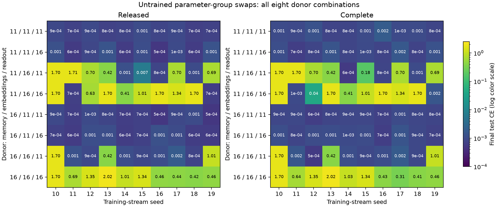

# Robustness transfers with the embedding group in the selected donor pair

13 September 2026. **Completed eight-configuration reciprocal group-swap experiment: 120 new models and 40 reused pure-donor outcomes.** [Protocol](GROUP_SWAP_PROTOCOL.md), [manifest](../analysis/group_swap/manifest.json), [full results](../analysis/group_swap/summary.json), [verification](../analysis/group_swap/verification.json).

Replacing the original embeddings of difficult initialization 16 with those of robust initialization 11 makes all ten streams reach low loss under both derivative rules, while keeping fast memory matrices and readout at donor 16. More broadly, **every configuration carrying donor-11 embeddings succeeds on all ten streams**, regardless of which donor supplies memory or readout.

Fast initial matrices alone do not reliably transfer robustness. Readout matters in the donor-16 embedding background: replacing only the readout raises low-loss counts from 0/10 to 7/10. Thus the evidence localizes the strongest tested effect to embeddings, with a meaningful readout interaction; it does not imply that embeddings are the only relevant group.

## Complete configuration results

Each row gives the donor of the **untrained** memory matrices, key/value/query embeddings and readout. All other initial parameters are identical between donors. Low loss is final validation CE < 0.1; CE means are final test nats per query over ten matched streams.

| Memory | Embeddings | Readout | Released CE | Complete CE | Released low loss | Complete low loss |
| ---: | ---: | ---: | ---: | ---: | ---: | ---: |
| 11 | 11 | 11 | 0.000839 | 0.001057 | 10/10 | 10/10 |
| 11 | 11 | 16 | 0.000918 | 0.001024 | 10/10 | 10/10 |
| 11 | 16 | 11 | 0.592243 | 0.609380 | 4/10 | 3/10 |
| 11 | 16 | 16 | 1.020429 | 0.962205 | 2/10 | 3/10 |
| 16 | 11 | 11 | 0.000770 | 0.000840 | 10/10 | 10/10 |
| 16 | 11 | 16 | 0.000844 | 0.000985 | 10/10 | 10/10 |
| 16 | 16 | 11 | 0.313432 | 0.313378 | 7/10 | 7/10 |
| 16 | 16 | 16 | 0.989160 | 0.970737 | 0/10 | 0/10 |

The strongest direct contrast replaces only embeddings in the all-16 background: mean CE falls by 0.988316 nats released and 0.969752 complete, with low-loss counts rising from 0/10 to 10/10. The reciprocal replacement of donor-11 embeddings with donor-16 embeddings in the all-11 background raises mean CE by 0.591404 released and 0.608323 complete, reducing low-loss counts from 10/10 to 4/10 and 3/10 respectively. This bidirectional evidence strengthens the attribution within the chosen donor pair.

Swapping only memory in the all-16 background yields 2/10 low-loss streams released and 3/10 complete, while mean CE changes by +0.031269 and −0.008532. Swapping donor-16 memory into the all-11 background preserves success on every stream and slightly reduces final mean CE. The particular fast initial matrices from the robust donor are therefore not necessary for the observed robustness in this test.

Replacing just donor-16 readout with donor-11 readout improves mean CE by 0.675728 released and 0.657359 complete, reaching low loss on 7/10 streams. Replacing readout in the opposite direction while retaining donor-11 embeddings preserves success on every stream. Readout effects depend on the embedding background.

## Marginal contrasts

The prespecified marginal contrast averages donor-11-minus-donor-16 CE over all four settings of the other two groups, within each stream. Negative favors donor 11. These descriptive contrasts concern the selected tensors, not a random population of donors.

| Group | Released mean contrast | Complete mean contrast |
| --- | ---: | ---: |
| Memory | +0.077556 | +0.071932 |
| Embeddings | -0.727973 | -0.712948 |
| Readout | -0.276017 | -0.252574 |

All per-stream differences, marginal ranges, validation areas, accuracies and no-adaptation metrics are retained in the JSON. The complete derivative changes some outcomes but preserves the principal embedding-transfer result.

## Methods, provenance and limits

The full 2×2×2 factorial uses donors 11 and 16 because the seed crossing identified 11 as the lowest-numbered robust start and 16 as the only start failing on every tested stream under both derivatives. This deliberate selection provides contrasting counterfactuals; it is not an independent donor replication. All ten streams 10–19 are retained, and the prior synthetic data split is reused.

Only initial tensor origins change. The architecture, 1,196 parameters, depth 2, chunk 4, mean scaling false, optimizer and 600-update budget remain fixed. Randomly initialized groups contain 512 fast-matrix entries, 384 embedding entries and 136 readout entries; the remaining 164 entries are equal between donors. No trained weights or optimizer state are transferred. Changing a tensor group is a causal intervention in this fixed algorithm, while its generality and geometric mechanism remain unestablished.

Before new training, preflight verified every hybrid tensor's origin and ten-step exact training parity for both pure donors at excluded stream 99. The manifest freezes source/helper/protocol hashes and all donor result/provenance hashes. All 160 saved checkpoints reproduce final test, final validation and no-adaptation metrics exactly; the verifier also regenerates stream hashes, reconstructs hybrid initial states, checks source/target isolation and preserves original baseline records.

New training processed 36,864,000 events and took 353.85 seconds in the measured CPU training loops, excluding evaluation and batch construction. Reused baselines contribute no new training cost. Runs use deterministic CPU float32, one thread, torch 2.14.0/einops 0.8.1, uv locks and source revision `33afe26100f8590272940e55dbee5067a8040da6`, with the same explicit CPU kernel substitutions. This is not fused CUDA validation, language-model training or a reproduction of the papers.

[Runner](../scripts/run_group_swap.py), [preflight](../scripts/check_group_preflight.py), [summary/plot](../scripts/summarize_group_swap.py) and [verifier](../scripts/verify_group_swap.py) have adjacent lockfiles. New checkpoints are under `models/group_swap/`; reused checkpoints retain earlier paths.

## Consequence and follow-up

This result weakens a fast-matrix-initialization-only account of the difficult donor. The next authorized, separately fixed [query/key/value swap protocol](EMBEDDING_SWAP_PROTOCOL.md) holds memory/readout at donor 16 and separates the three embeddings. It tests which embedding tensors carry the transfer, without yet assuming a geometric explanation. The stronger original-paper causal attribution remains unresolved.

**Follow-up completed:** the [query/key/value factorial](EMBEDDING_SWAP_RESULTS.md) finds that query-only and value-only replacements each rescue the difficult background, while their combination with the original keys largely loses the benefit. This further localizes the result to interactions among initial representations.
