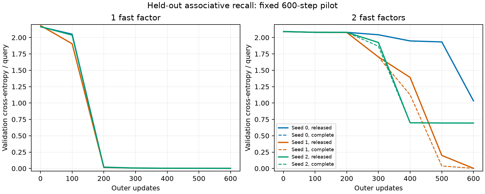

# Held-out pilot: the complete derivative does not consistently improve final recall

13 September 2026. **Completed synthetic sequence-modeling pilot, not language-model pretraining or a reproduction of either paper.** [Frozen protocol](RECALL_PILOT_PROTOCOL.md), [run manifest](../analysis/recall_pilot/manifest.json), [summary data](../analysis/recall_pilot/summary.json).

Restoring the omitted derivative changes training, but it does **not consistently improve final held-out quality in this pilot**. The deep learner's much larger seed-to-seed variation persists under both derivative rules. This is a useful limit on the interpretation of the implementation finding: a missing derivative is not by itself an explanation for the negative depth trend.

## What was run

Each episode presents eight key–value assignments, followed by eight queries in a different order. Only query predictions contribute to the outer cross-entropy. Query inputs contain no target value, and memory writes are disabled during the query phase. Train, validation and test splits contain 32,000, 4,096 and 4,224 distinct mappings respectively; complete mappings do not overlap across splits. Each final test evaluates 33,792 queries. This is new-mapping generalization within a synthetic distribution.

The source-loaded Modular TTT graph uses one or two Linear–SiLU factors, width 16, one head, chunk size 4, learned scalar per-factor rates/decay and no mean scaling. Learned key/value/query embeddings and a normalized readout make this an outer-trained memory system rather than the previous fixed-input diagnostic. Initial fast weights use std 0.02; inner rates start at 1e-3. The exact recipe is in the protocol.

Three paired seeds, 0/1/2, each train both derivative modes at each depth for 600 updates using identical initial weights and batches within a pair. AdamW uses outer LR 0.003, weight decay 0.01, batch 32 and gradient clipping at 1.0. No validation-based model selection or test-driven extension occurred. All results use the final checkpoint.

Each model processes 307,200 events; the 12 models together process 3,686,400 events. Parameter counts are 874 for shallow and 1,196 for deep. Fast matrix counts are 256 and 512. Thus derivative modes are parameter-matched within depth, but depth comparisons are not. These are fixed-token runs, not equal-FLOP or equal-wall-time runs. Summed training-loop time was about 26.5 CPU seconds, excluding validation/test, setup and verification; this is not a throughput benchmark.

## Final test results

CE is cross-entropy in nats per query. ΔCE is complete minus released: negative favors the complete derivative.

| Depth | Seed | Released CE | Complete CE | ΔCE | Released accuracy | Complete accuracy |
| --- | --- | ---: | ---: | ---: | ---: | ---: |
| 1 | 0 | 0.00154631 | 0.00154631 | 0 | 100.000% | 100.000% |
| 1 | 1 | 0.00171317 | 0.00171317 | 0 | 100.000% | 100.000% |
| 1 | 2 | 0.00163664 | 0.00163664 | 0 | 100.000% | 100.000% |
| 2 | 0 | 1.03382704 | 1.03466215 | +0.00083511 | 50.071% | 50.139% |
| 2 | 1 | 0.00243277 | 0.00201016 | −0.00042262 | 100.000% | 100.000% |
| 2 | 2 | 0.69407556 | 0.69424006 | +0.00016450 | 62.269% | 62.130% |

All shallow pairs have bit-identical final state hashes, as predicted for this derivative omission. Deep pairs start with identical forward loss and state hashes, have nonzero first-step gradient differences, and finish with different weights.

Across deep seeds, mean ΔCE is **+0.00019233**, with a range of **−0.00042262 to +0.00083511**. Mean deep accuracy is 70.780% released versus 70.756% complete, a difference of −0.0237 percentage points. The large spread between deep seeds dwarfs these final paired differences. Three seeds do not establish statistical equivalence or a general absence of benefit.

The validation curves show that changing the derivative can affect learning speed: for example, deep seed 1 improves earlier under the complete derivative. This is a descriptive secondary observation, not the primary final-checkpoint outcome and not a selected stopping point. The shallow curves overlap exactly; deep seeds 0 and 2 retain poor final solutions under both rules. No additional steps were added after seeing this result.

## Does the task actually use mutable memory?

With both gradient writes and decay disabled at evaluation, test accuracy falls to **12.24–12.72%**, near the 12.5% chance level. Mean no-adaptation accuracy is 12.64% for shallow, 12.52% for released deep and 12.33% for complete deep. This ablation does not retrain the model. It supports that successful recall depends on within-episode adaptation, rather than a fixed key-to-class mapping.

The validation procedure also changes written values while adaptation is disabled and confirms identical logits. That check makes the no-adaptation baseline independent of value information carried through a data-dependent decay gate. It complements the input checks that query values are masked to zero.

## Interpretation and limits

The pilot supports three separate claims:

1. The derivative omission is behaviorally active during outer training, consistent with the earlier mathematical and graph-level audits.
2. Supplying that derivative does not remove the depth penalty consistently under this fixed small-task recipe. One deep seed solves the task under either rule; the others remain substantially behind the shallow models under either rule.
3. Gradient correctness relative to a specified forward objective and empirical optimizer quality are different questions. The full derivative is mathematically supported by finite differences; that does not guarantee a large generalization improvement over a partial derivative.

This result neither establishes nor rules out an effect on Modular TTT's published language-model loss. The task is synthetic, model and fast states are tiny, there is one fixed training recipe, depth is not capacity-matched, execution is CPU float32 with explicit kernel substitutions, and the chunk size differs from both papers' principal settings. Original checkpoint provenance remains unresolved. The held-out set contains novel mappings but the same symbols and task distribution.

The next study should retain the derivative control without assuming it is the dominant cause. Gradient-reference frequency, initialization/conditioning, and topology remain candidates; a separately specified comparison is needed to discriminate them. This pilot alone does not justify scaling a language-model campaign or requesting a generic served model. A bounded negative result is the appropriate conclusion here.

## Reproducibility

[Training script](../scripts/run_recall_pilot.py), [training lockfile](../scripts/run_recall_pilot.py.lock), [summary script](../scripts/summarize_recall_pilot.py), and [checkpoint/split verifier](../scripts/verify_recall_pilot.py). The manifest hashes the frozen protocol, training code, engine and data splits. Per-pair JSON files retain history, timings, metrics and checkpoint hashes; checkpoints are local under `models/recall_pilot/`. The [verification record](../analysis/recall_pilot/verification.json) records split isolation, initial-loss equality, exact shallow controls, checkpoint integrity and fresh-model reproduction of test metrics. Runtime is pinned to PyTorch 2.14.0 (`08187d9e0fba026dc8217405802ab5381dc88d90`), one CPU thread and deterministic algorithms. No Mac Studio model was installed or called.

**Follow-up completed:** the [160-model gradient-refresh comparison](REFRESH_COMPARISON_RESULTS.md) adds ten fresh seeds and four chunk sizes. More frequent refresh did not reliably rescue deep memory. Some derivative effects are substantially larger in the new seeds, refining the scope of this initial pilot's result.
