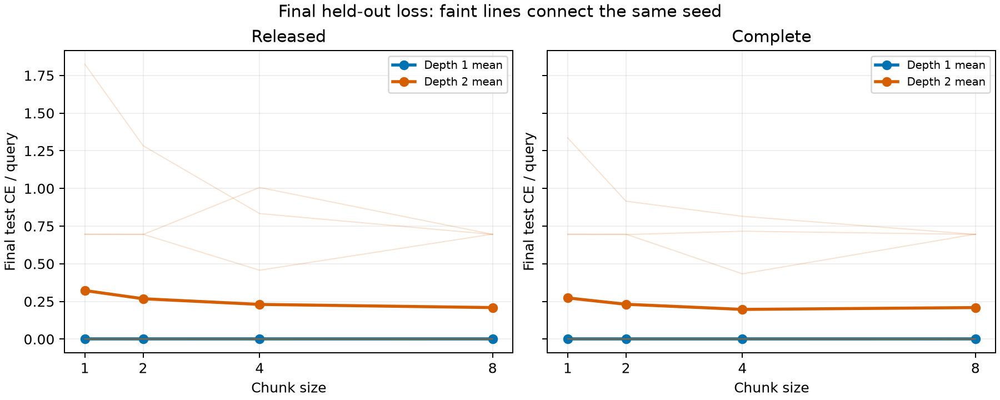
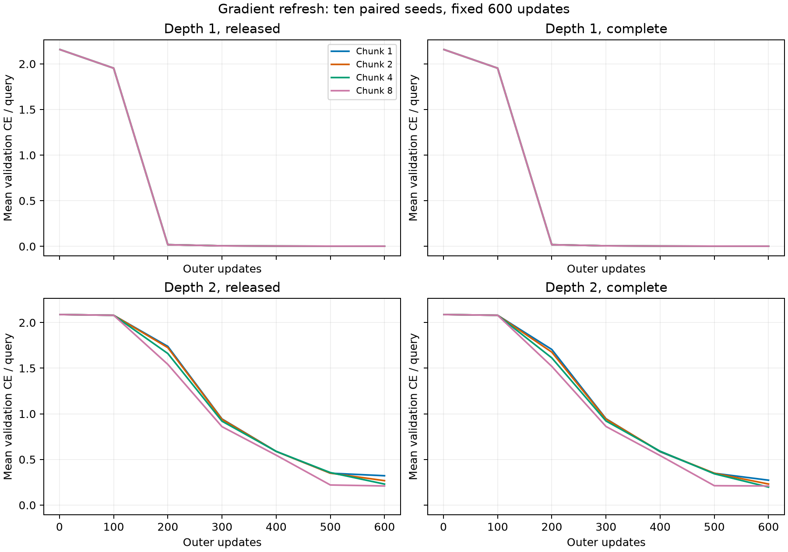

# More frequent gradient refresh did not rescue deeper recall memory

13 September 2026. **Completed 160-model synthetic recall comparison.** [Frozen protocol](REFRESH_COMPARISON_PROTOCOL.md), [manifest](../analysis/refresh_comparison/manifest.json), [full results](../analysis/refresh_comparison/summary.json), [verification](../analysis/refresh_comparison/verification.json).

The prespecified comparison does **not support more frequent gradient recomputation as a remedy for the depth penalty in this task**. Under both derivative rules, chunk 1 has worse mean final deep loss than chunk 8. The mean difference is dominated by one seed, and descriptive bootstrap intervals include zero. This is not evidence that larger chunks are universally superior.

A more stable observation is that **the same seven deep seeds reach low validation loss in every configuration, while the same three do not**. All shallow models achieve 100% final recall. This shifts the next useful question toward what separates successful and unsuccessful initializations under this recipe; neither derivative completion nor refresh frequency reliably changes which seeds succeed.

## Final outcomes

Each entry averages ten paired seeds. CE is final test cross-entropy in nats per query, evaluated on 33,792 queries per model. Shallow derivative pairs are bit-identical; their mean CE ranges from 0.001550 to 0.001570 across chunks, with 100% accuracy throughout.

| Chunk | Deep released CE | Deep complete CE | Released accuracy | Complete accuracy | Deep seeds below 0.1 validation CE, released / complete |
| ---: | ---: | ---: | ---: | ---: | ---: |
| 1 | 0.322364 | 0.273435 | 84.490% | 87.132% | 7/10 / 7/10 |
| 2 | 0.268092 | 0.231302 | 87.451% | 88.176% | 7/10 / 7/10 |
| 4 | 0.230367 | 0.197162 | 88.180% | 89.810% | 7/10 / 7/10 |
| 8 | 0.209290 | 0.209333 | 88.739% | 88.732% | 7/10 / 7/10 |

The primary interaction is the chunk-1-minus-chunk-8 change in deep CE, minus the corresponding shallow change. A negative value would favor the proposed deeper-memory benefit from more frequent refresh.

| Derivative rule | Mean interaction | Descriptive 95% paired bootstrap interval | Seeds with negative interaction |
| --- | ---: | ---: | ---: |
| Released | +0.113055 | [-0.000114, +0.339147] | 4/10 |
| Complete | +0.064084 | [-0.000196, +0.192330] | 4/10 |

For the released derivative, seed 17 alone contributes an interaction of +1.130168; the other nine range from −0.000584 to +0.000767. This concentration matters more than the favorable direction of a few tiny differences. The complete-rule contrast has the same concentration. All per-seed contrasts, including the secondary chunk-1-versus-chunk-4 comparison, are retained in the summary JSON. Ten seeds do not establish equivalence or a universal harmful effect of refresh.

Seeds 10, 16 and 17 never reach the prespecified validation threshold under any chunk or derivative rule. Their final CE nevertheless changes: for example, seed 17 released CE improves from 1.82500 at chunk 1 to 0.69481 at chunk 8. Seed 10 instead fares worse at chunk 4 than at either endpoint. A single monotonic refresh explanation does not describe all unsuccessful seeds.

## Learning speed and the derivative finding

The mean validation curves also fail to support a faster-refresh advantage. Normalized validation CE area is 1.1492 at chunk 1 versus 1.0644 at chunk 8 under the released rule, and 1.1391 versus 1.0589 under the complete rule; lower is better. These are secondary descriptive outcomes. Most successful seeds cross 0.1 at the same scheduled evaluation across settings. Deep seed 18 with the complete derivative crosses at step 300 for chunk 1 and step 200 otherwise. Unreached thresholds remain censored; the analysis does not assign them a fictitious time of 600.

The larger comparison also refines the earlier three-seed derivative result. Completing the derivative reduces mean deep CE by 0.04893, 0.03679 and 0.03321 for chunks 1, 2 and 4 respectively, while chunk 8 changes by +0.000043. Those reductions are not uniform across seeds: at chunk 1, seed 17 improves by approximately 0.48934 nats, accounting for almost the entire mean benefit. Thus the omission can have a sizeable effect on an individual trajectory, even though completing it does not convert any of the three unsuccessful seeds into a low-loss solution in this comparison. The original three-seed finding remains a result of that pilot, not a general claim that the derivative cannot matter.

Across all 160 models, disabling both associative writes and decay yields 12.04–12.81% accuracy, near the 12.5% chance level. Every checkpoint reproduces its saved test and ablation metrics exactly. All shallow derivative pairs remain bit-identical; deep derivative pairs differ. The verifier also regenerates identical training batches across chunks and checks identical initial parameters, disjoint mapping splits, source/protocol hashes and no-adaptation invariance to altered written values.

## What the comparison controls

This follow-up retains the eight-write/eight-query associative-recall task and fixed 600-update recipe from the first pilot. It crosses chunks 1, 2, 4 and 8 with depths 1 and 2 and released/complete derivatives, using ten fresh paired seeds 10–19. The 160 models each process 307,200 events. The training, validation and test mapping split remains unchanged from the earlier pilot; these are new training seeds, not a new untouched test set.

At each depth/seed, all chunks and derivative modes begin with the same parameter values and receive exactly the same minibatches. Query inputs contain no target values, and adaptation is disabled during queries. The source-loaded memory recomputes the inner-gradient reference 8, 4, 2 or 1 times during the write phase. Mean scaling is false, and the per-token rate and decay formulas are unchanged; there is no explicit chunk-dependent rate multiplier. Changing chunk size nevertheless changes the update algorithm, gradient values and learned controls.

Within a depth, chunk and derivative comparisons have identical parameter counts. Shallow and deep models have 874 and 1,196 parameters, including 256 and 512 fast matrix entries, so depth comparisons are not parameter-matched. Runs match training events, not compute. Timing covers the training loop only, excluding evaluation and batch construction, and is affected by warm-up, order and scheduling. The shorter chunks execute more graph passes.

The source revision remains `33afe26100f8590272940e55dbee5067a8040da6`. The earlier pilot and graph-engine files are imported without modification. Only `memory.chunk_size` changes in the model subclass. CPU scalar-decay substitutions remain in place; this is not a fused CUDA/BF16 validation.

Training-loop time totaled **428.14 CPU seconds**, excluding evaluation and batch construction. For deep released models, mean training time was 4.36 seconds at chunk 1 and 2.56 seconds at chunk 8; complete-rule means were 4.47 and 2.60 seconds. These are descriptive CPU timings, not a compute-matched experiment or a fused-kernel benchmark.

## Verification and interpretation limits

Before training, eight float64 graph checks covered every depth/chunk combination using a separate 24-token diagnostic and seed 99. Complete gradients matched the independent per-token reference within 1.05×10⁻¹⁷, state error was below 2.23×10⁻¹⁶, and the maximum directional finite-difference error was 2.59×10⁻¹⁰. Causality and reset checks passed. Chunk 4 matched the frozen pilot's initial weights and outputs exactly.

The primary contrast was fixed before training: the chunk-1-minus-chunk-8 change in deep test cross-entropy, minus the same change in shallow cross-entropy, under the released derivative. Negative values indicate a greater benefit for deeper memory. The complete derivative is the corroborating comparison. Bootstrap intervals resample the ten paired seeds; they describe seed uncertainty under this fixed recipe, not task or architecture uncertainty. Chunk-4 comparisons and validation-speed measures are secondary. No checkpoint selection or outcome-driven extension was performed.

The experiment addresses a mechanism on a small synthetic task. It does not reproduce the papers' depth sweeps, test chunks 16 versus 256, or establish a general depth advantage. Larger chunks affect the trajectory of the chunked update as well as reference age; this manipulation cannot separate every downstream consequence of that algorithm change. Original checkpoint provenance and Titans' exact depth-run settings remain unresolved.

## What follows from this result

The bounded refresh comparison is complete. It gives no reason to launch a larger refresh sweep on the expectation that it will rescue depth. A useful next diagnostic would compare initial memory outputs, activation/gradient scales and value separability for successful and unsuccessful seeds, then specify a conditioning intervention before further held-out evaluation. Seed identity changes initialization and training order together here; their effects are not yet separated. Such a diagnostic should separate these sources before attributing failures specifically to fast-weight initialization. This is a proposed next step, not a completed result or evidence that conditioning is the cause.

## Reproducibility

[Runner](../scripts/run_refresh_comparison.py), [preflight reference checks](../scripts/check_refresh_preflight.py), [summary/plots](../scripts/summarize_refresh_comparison.py), and [checkpoint verifier](../scripts/verify_refresh_comparison.py) each have adjacent uv lockfiles. Run with `uv run --locked scripts/<name>.py`. The runner freezes protocol/helper hashes and supports resuming completed records only with matching metadata and checkpoint hashes. Run preflight before the first training invocation; the retained preflight result is part of the manifest. The verifier checks all 160 local checkpoints under `models/refresh_comparison/`. Per-pair JSON files preserve learning curves, timing, batch hashes and checkpoint hashes. No upstream files were edited and no remote model was installed or called.

**Follow-up completed:** the [initialization × training-stream crossing](SEED_SEPARATION_RESULTS.md) separates the previously coupled seeds. It finds substantial initialization effects and still larger interaction with the sampled stream. The seven-versus-three success partition above is conditional on coupled initialization/data seeds, not an initialization-only classification.
