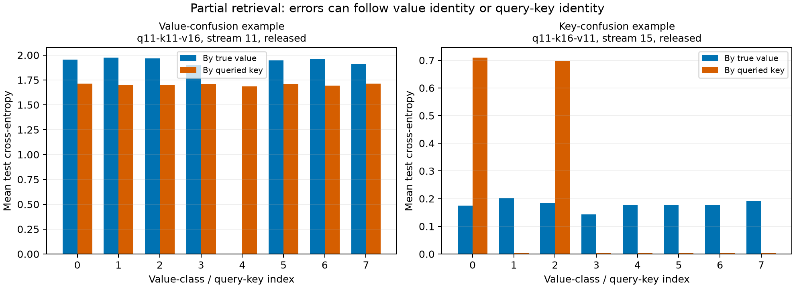

# Failed checkpoints show distinct partial-retrieval patterns

13 September 2026. **Post-hoc read-only inspection of all 160 embedding-swap checkpoints.** [Value-conditional diagnostics](../analysis/class_collapse/diagnostics.json), [query-key extension](../analysis/class_collapse/retrieval_modes.json). No model was trained in these inspections.

The failures do not all have the same form. Under exploratory diagnostic tolerances, **29 of 52 failed checkpoints fit confusion among a fixed set of value classes, and 7 fit confusion among a fixed set of query keys**. None fits both; 16 remain unclassified by these simple single-cluster descriptions. The categories describe final behavior, not proven causes, stable attractors or population rates.

## Why the loss plateaus suggested a check

If a task has eight equally frequent classes, resolves 8−m of them perfectly and predicts uniformly over a remaining cluster of m, its mean CE is `(m/8) ln(m)`. For m=2,3,4,5,6,7 this gives approximately 0.1733, 0.4120, 0.6931, 1.0059, 1.3438 and 1.7027 nats. Several observed losses lie near these values. A matching scalar loss alone is insufficient evidence: many distributions can share a CE.

The first inspection grouped every test prediction by true value, retaining classwise CE, probabilities, confusion counts and raw memory-read statistics. Each value has exactly 4,224 test queries. An exploratory unresolved-value set is defined by per-value CE ≥0.1. A single uniform cluster of those values fits many checkpoints, but fails badly for some low-loss plateaus whose errors spread across all value identities.

The second inspection groups by queried key and aligns the eight query positions within every episode. For an unresolved-key set, the candidate distribution is uniform over the values actually assigned to those keys in that episode. This distinguishes a failure to discriminate particular value classes from a failure to retrieve particular key identities, even though assignments vary between episodes.

## Observed modes

The value-confusion example is `q11-k11-v16`, stream 11, released derivative. Its CE is approximately 1.703. Seven value classes have CE near ln(7), while value 4 is recovered with very low loss. Mean predictions for the unresolved values are close to uniform over those seven labels. This example uses donor-16 memory/readout; only embedding origins vary in the preceding experiment.

The key-confusion example is `q11-k16-v11`, stream 15, released derivative. Its CE is approximately 0.178, close to 2/8·ln(2). Query keys 0 and 2 remain unresolved while other keys are recovered. Since their assigned values vary each episode, errors spread across true value classes. Predictions for these two queries are close to uniform over their two episode-specific target values.

The exploratory fit rule requires at least two unresolved members, total CE within 0.05 nats of the single-cluster formula, and mean probability L1 distance below 0.15 from the candidate uniform distribution. These tolerances were chosen during post-hoc diagnosis and were not part of the training protocols. The 36 fitted cases should not be presented as a confirmatory prevalence estimate. The 16 unclassified failures include mixed or partially resolved patterns; they are retained without forcing them into a category.

## What the memory representations show

For the seven key-cluster fits, the mean within-episode raw-memory distance between unresolved queries is about 3.4–8.0% of the mean distance across all query pairs (median 4.5%). Their within-episode prediction L1 distances range from about 0.014 to 0.080. This supports nearly merged retrieval outputs for those queried keys.

The 29 value-cluster fits have nearly matching predicted distributions within their unresolved sets, but their raw memory vectors are not generally identical: unresolved-pair raw distances are 20–82% of the overall pair-distance average (median 52%). Class-mean centroids can be close even when within-class variation remains. It would therefore overstate the evidence to call every value-confusion case a total erasure from memory. The decoder may fail to use remaining information, or the variations may be irrelevant to value identity.

This distinction motivates a separately specified [frozen-memory readout probe](FROZEN_READOUT_PROTOCOL.md): fit a new linear head to detached normalized memory features while preserving every non-head parameter. That test addresses accessible information, not the historical cause of the optimization path.

## Reproducibility and boundaries

[Value inspection](../scripts/inspect_class_collapse.py), [key/value inspection](../scripts/inspect_retrieval_modes.py), and [plot script](../scripts/summarize_retrieval_modes.py) have uv lockfiles. Each checkpoint hash is checked; classwise CE independently reproduces the original aggregate CE within 1e-6. The first value-inspection attempt completed its evaluations but failed while assembling source metadata because of an incorrect module reference; the harness reference was corrected and the read-only run repeated. No training artifact was modified and no diagnostic outcomes were used to change training.

Both inspections use the existing test mappings and fixed order seed 8200, deterministic CPU inference and the same source-loaded graph. The query-key extension records the exact input value-diagnostic hash. It retains all probability/distance summaries, including non-fitting cases. These are adaptive analyses of selected-donor experiments on a synthetic task, not evidence of the same failure modes in the original paper models.

**Probe completed:** [six frozen-readout fits](FROZEN_READOUT_RESULTS.md) retain the selected value/key ambiguities while preserving successful controls. This narrows a readout-only explanation without proving complete information loss.
