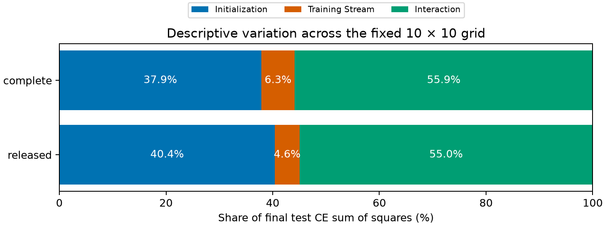
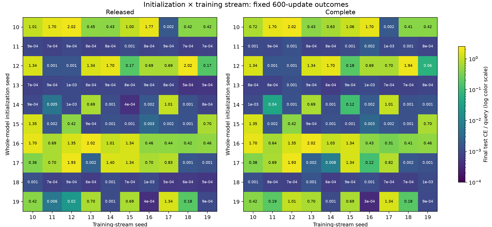

# Initialization matters, but its interaction with the training stream is larger

13 September 2026. **Completed initialization × training-stream separation: 180 new models plus 20 reused diagonal outcomes.** [Frozen protocol](SEED_SEPARATION_PROTOCOL.md), [manifest](../analysis/seed_separation/manifest.json), [complete results](../analysis/seed_separation/summary.json), [verification](../analysis/seed_separation/verification.json).

The seed separation rules out a simple account in which either initialization or the training stream alone determines success. **Whole-model initialization has a substantial main effect, but initialization–stream interaction accounts for the largest share of final loss variation in this grid.** Some initializations are robust across all streams, some consistently struggle, and several depend strongly on the stream they encounter.

This qualifies the earlier seven-successful/three-unsuccessful seed partition. That partition held across chunk and derivative settings while initialization and data seeds were coupled. Once they are crossed, some previously successful initializations frequently fail, while some previously unsuccessful ones can succeed. The prior result remains valid for its paired seed runs; it did not identify which seed component caused the outcome.

## Primary result: finite-grid variation

The table decomposes final test cross-entropy variation over 100 initialization–stream combinations per derivative rule. Percentages are shares of the total sum of squares, with no population variance or significance claim.

| Derivative | Initialization | Training stream | Interaction | Mean test CE | Low-loss cells |
| --- | ---: | ---: | ---: | ---: | ---: |
| Released | 40.43% | 4.59% | 54.98% | 0.420880 | 56/100 |
| Complete | 37.87% | 6.27% | 55.86% | 0.409660 | 55/100 |

“Low loss” means final validation CE below 0.1 nats, the prespecified secondary criterion. Final mean test accuracy is 79.95% released versus 80.49% complete. The primary endpoint is test CE; these metrics need not rank derivative modes identically.

The initialization main effect is much larger than the stream main effect, but **the small stream main effect does not mean the stream is unimportant**. A stream can help one initialization and hurt another, leaving a modest average column effect and a large interaction. Approximately 55% of the variation has exactly this nonadditive form. The decomposition is computed separately for each derivative and was checked against four known row-only, column-only, interaction-only and additive examples.

## Which initializations are robust?

Rows hold initialization fixed; columns hold the full sampled training stream fixed. Cell labels are rounded final test CE; the color scale is logarithmic and exact values are in the summary JSON. The diagonal comes from the earlier refresh comparison, unchanged.

| Initialization seed | Prior diagonal low loss? | Released low-loss streams | Complete low-loss streams | Released mean test CE | Complete mean test CE |
| ---: | :---: | ---: | ---: | ---: | ---: |
| 10 | No | 1/10 | 1/10 | 0.921957 | 0.910414 |
| 11 | Yes | 10/10 | 10/10 | 0.000839 | 0.001057 |
| 12 | Yes | 2/10 | 3/10 | 0.814202 | 0.796753 |
| 13 | Yes | 10/10 | 10/10 | 0.000773 | 0.000844 |
| 14 | Yes | 8/10 | 7/10 | 0.171347 | 0.186448 |
| 15 | Yes | 7/10 | 7/10 | 0.247761 | 0.247792 |
| 16 | No | 0/10 | 0/10 | 0.989160 | 0.970737 |
| 17 | No | 3/10 | 4/10 | 0.725781 | 0.529025 |
| 18 | Yes | 10/10 | 10/10 | 0.000783 | 0.000900 |
| 19 | Yes | 5/10 | 3/10 | 0.336194 | 0.452630 |

Initializations **11, 13 and 18** reach low loss and 100% test accuracy on every stream under both derivative rules. Initialization **16** reaches low loss on none, despite substantial variation in its final CE. Those are strong finite-grid examples of robust and consistently difficult starts.

Initialization **12** exposes the confounding in the earlier diagonal: it succeeded there, but reaches low loss on only 2/10 streams under the released rule and 3/10 under the complete rule. Initialization **10**, previously unsuccessful, succeeds with stream 17 under both rules. Initialization **17** succeeds on 3/10 streams released and 4/10 complete. Thus a previously “bad seed” can supply a useful training stream for a different initialization.

Relative to the already observed diagonal, changing streams rescues 4 of 27 off-diagonal combinations for previously unsuccessful initializations under the released rule, and 5 of 27 under the complete rule. It disrupts 18 of 63 combinations for previously successful initializations released, and 20 of 63 complete. These are conditional descriptive counts, not estimates for a randomly chosen initialization population.

Across streams, low-loss counts range from 4 to 7 initializations out of 10 under either derivative rule. There is no stream in this tested set that makes every initialization succeed or fail. The full column summaries and learning-speed measurements are retained in the result JSON.

## What the derivative changes after separation

Completing the derivative changes mean test CE by **−0.011220 nats**, but gives 55 low-loss cells versus 56 under the released rule. It converts two cells from failure to low loss and three in the opposite direction. This supports an outcome-dependent derivative effect rather than a uniform improvement.

The two low-loss rescues are initialization/stream pairs (12, 19) and (17, 14). The latter improves test CE by about 1.38765 nats. The three disruptions are (14, 15), (19, 11) and (19, 12); the last worsens CE by about 0.98407 nats. The remaining 95 cells retain their low-loss classification, although their numerical losses and trajectories can differ. The complete derivative remains the mathematically verified derivative of the tested forward algorithm; that property alone does not determine which optimizer trajectory generalizes better.

With both within-episode writes and decay disabled, test accuracy ranges from **11.97% to 12.91%**, near the 12.5% chance level. This remains an inference ablation, not a retrained baseline.

## Design and interpretation

The comparison fixes depth 2, chunk 4, width 16, one head and the prior 600-update recipe. It crosses all ten initialization seeds 10–19 with all ten training-stream seeds 10–19, retaining both derivative rules. Each cell contains two models; the complete grid has 200 outcomes. The 20 diagonal outcomes are reused unchanged from the refresh experiment, and 180 off-diagonal models are newly trained. This avoids choosing a subset based on extreme prior results, but the diagonal observations and task informed the follow-up.

The initialization seed controls the complete initial model, including learned embeddings, initial fast matrices and readout. The independent training generator controls sampled mappings and both across-batch and within-episode order. Therefore the factor called “stream” includes example sampling as well as order. It does not keep a fixed multiset of examples and merely permute them. Initialization also includes multiple parameter groups; the comparison cannot attribute an effect specifically to fast initial weights.

All cells have 1,196 parameters, including 512 fast matrix entries, and process the same number of training events. A fixed initialization yields an identical initial state across streams. A fixed stream yields an identical 600-step batch sequence across initializations. Within each cell the derivative modes start identically and see identical data. Memory state resets at episode boundaries; query targets never enter memory writes.

For each derivative mode, the primary analysis decomposes final test CE variation over the balanced 10×10 grid into initialization, stream and interaction terms. The row/column means and residual interaction are orthogonal, so their sums of squares add to the total. The plotted percentages describe these 100 specific seed combinations. They are not an estimate of population causal variance or a significance test. With one deterministic outcome per cell, there is no independent noise estimate; interaction captures nonadditive dependence of outcomes on the two factors.

Low-loss counts use final validation CE < 0.1, fixed before new training. Rescue/disruption counts compare each initialization's off-diagonal outcomes with its already observed diagonal status. They are secondary descriptive outcomes. Final checkpoints are used throughout; no model selection, extra steps or outcome-driven change occurred. The synthetic mapping splits and evaluation-order seeds are reused from the earlier pilots, so this is not evaluation on a fresh untouched test set.

## Reproducibility and limits

The new runner imports the frozen model/helpers and changes only the separation of initialization and stream seeds. Upstream revision remains `33afe26100f8590272940e55dbee5067a8040da6`; the explicit CPU kernel substitutions and their limitations remain. Before new runs, a training-only ten-step test at diagnostic seed 99 reproduced the previous runner's initial/final state hashes, batch hash, training losses and gradient norms exactly. Donor result files, checkpoints and prior provenance were verified before reuse.

The manifest freezes the protocol, runner, preflight and imported helpers, plus every donor result file and the previous manifest/verification records. New checkpoints remain under `models/seed_separation/`; reused checkpoint paths still refer to `models/refresh_comparison/`. Per-cell JSON files mark origin and retain state/batch hashes, validation history, final metrics and training-loop timing. Each new script has an adjacent uv lockfile. Execution uses PyTorch 2.14.0, einops 0.8.1, CPU float32, one thread and deterministic algorithms.

The experiment isolates random-seed factors under one fixed small-task recipe. It does not establish the mechanism inside an initialization effect, generalize to another architecture or optimizer, reproduce either paper, or test fused CUDA/BF16 behavior. No model endpoint was used. A parameter-group swap or conditioning intervention would be a distinct follow-up; none is claimed here.

The new training loops totaled **530.43 CPU seconds** and processed **55,296,000 events**. The 20 reused outcomes contribute no new training time or events. Times exclude evaluation, batch construction and verification, and are descriptive rather than a throughput or compute-matched comparison.

All 200 grid checkpoints reproduce their final test, final validation and no-adaptation metrics exactly. Verification regenerates every 600-step training stream and confirms row-constant initialization hashes and column-constant batch hashes, preserves all donor records, and checks source/code/protocol integrity, split isolation and no-adaptation invariance to altered written values. The verifier records 180 new and 20 reused outcomes separately.

[Runner](../scripts/run_seed_separation.py), [training-only preflight](../scripts/check_seed_preflight.py), [summary and plots](../scripts/summarize_seed_separation.py), and [verifier](../scripts/verify_seed_separation.py) can be run with `uv run --locked scripts/<name>.py`. Run preflight before the first training invocation; the retained preflight JSON is part of the frozen manifest.

## Consequence for the study

The separation is complete. It gives a reason to study whole-model initial conditions while retaining multiple training streams as an experimental factor. It does **not** establish that fast-matrix initialization, rather than embeddings or readout, is responsible. A next bounded intervention could exchange initial parameter groups between robust and difficult starts, with reciprocal swaps and matched streams. That would test which components transfer robustness; it is a proposed experiment, not an inference already established by these results.
